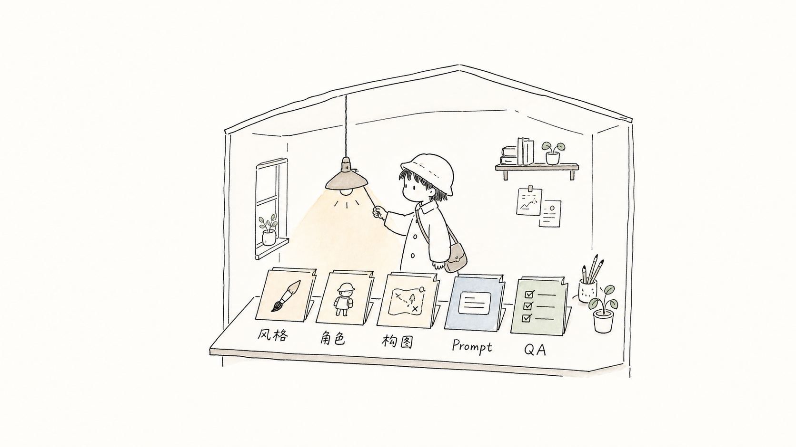
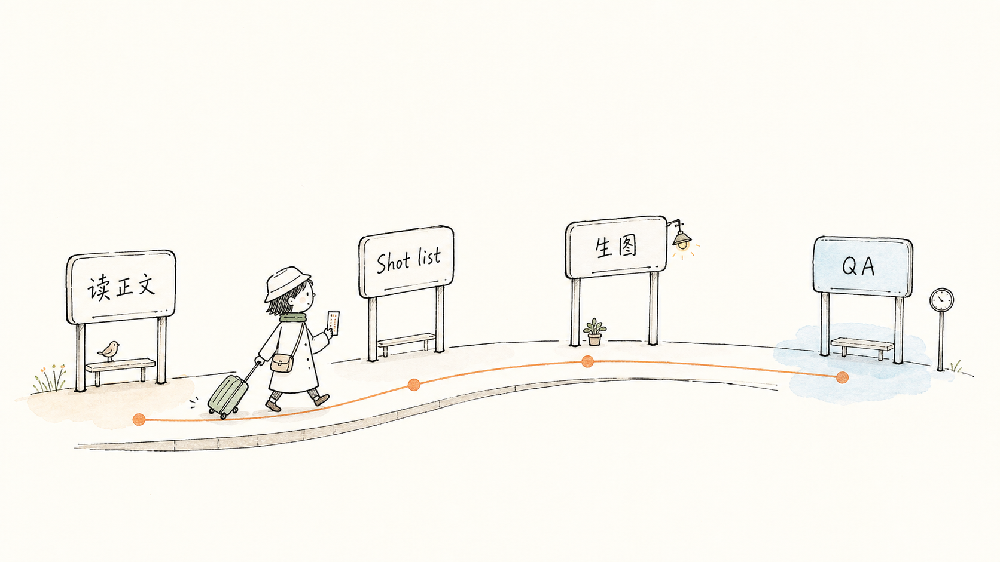
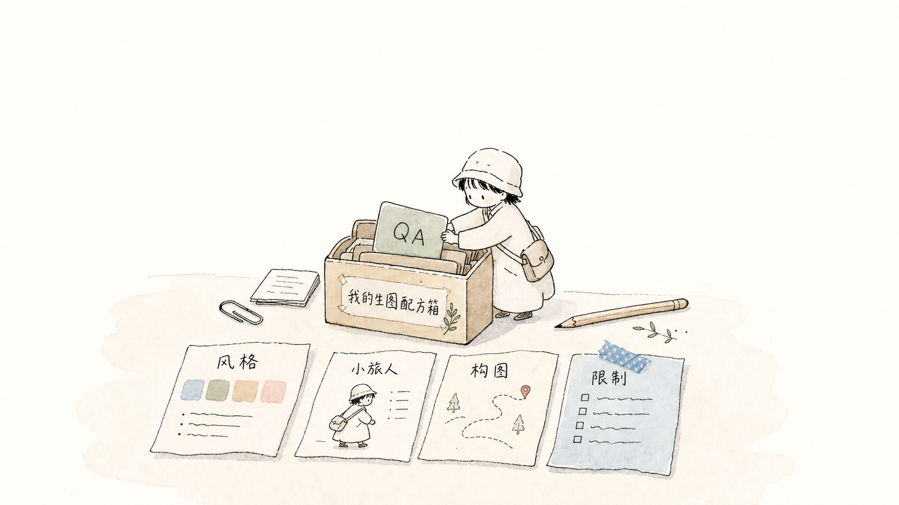
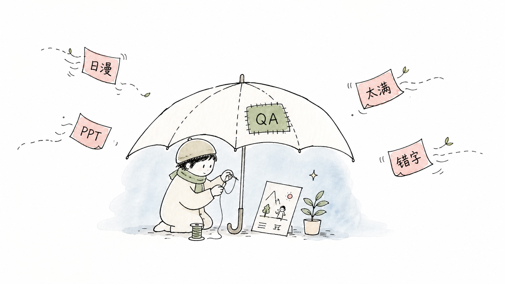

# Japanese Handdrawn Illustrations



A Codex skill for turning Chinese articles, notes, teaching materials, and workflow documents into quiet Japanese editorial-style hand-drawn illustrations.

Instead of using a single mega prompt, this project packages a reusable visual workflow: style DNA, a recurring character, composition patterns, prompt templates, and QA rules.

## Why This Project

Most AI image prompts are fragile. They work once, drift quickly, and are hard to reuse across articles.

This skill makes the illustration process more maintainable:

- **Reusable visual system**: not just a prompt, but a small structured skill.
- **Consistent character IP**: the recurring character `小旅人` anchors the style.
- **Article-first workflow**: starts from the article's cognitive anchor, not random decoration.
- **Built-in QA**: prevents common failures such as anime drift, PPT-like diagrams, overfilled layouts, and unreadable labels.
- **Chinese-content friendly**: optimized for Chinese handwritten labels and Chinese article illustrations.
- **Lightweight structure**: easy to fork, edit, and adapt for your own visual language.

## Demo Images

| Skill system | Workflow | Prompt cards | QA guardrail |
|---|---|---|---|
|  |  |  |  |

## What It Generates

The default output style is:

- 16:9 horizontal article illustrations
- pure white or very pale warm off-white background
- thin black hand-drawn line art
- sparse muted watercolor accents
- lots of empty space
- short Chinese handwritten labels
- a quiet recurring traveler figure, `小旅人`

The skill explicitly avoids:

- anime or manga style
- big-eyed characters
- children's picture-book look
- commercial poster illustration
- PPT infographics
- dense system diagrams
- imitation of any specific artist or animation studio

## Skill Structure

```text
skills/japanese-handdrawn-illustrations/
├── SKILL.md
├── agents/openai.yaml
├── references/
│   ├── style-dna.md
│   ├── character-ip.md
│   ├── composition-patterns.md
│   ├── prompt-template.md
│   └── qa-checklist.md
└── assets/examples/
```

## How It Works


1. Read the article or note.
2. Identify the cognitive anchors worth illustrating.
3. Draft a short shot list.
4. Generate each image as a standalone 16:9 illustration.
5. Check the image against the QA checklist.
6. Save final assets with stable filenames.

## Install

Copy the skill folder into your Codex skills directory:

```bash
cp -R "skills/japanese-handdrawn-illustrations" "$HOME/.codex/skills/"
```

Then start a new Codex session and invoke:

```text
Use $japanese-handdrawn-illustrations to design and generate Japanese hand-drawn illustrations for this Chinese article.
```

## Example Use Cases

- Chinese blog post illustrations
- Obsidian or Notion knowledge notes
- medical education explainers
- learning notes and study workflows
- creator workflow diagrams
- lifestyle essays
- methodology articles

## Example Prompts

See [examples/example-prompts.md](examples/example-prompts.md).

## Project Notes

This project was adapted from the structure of `ian-xiaohei-illustrations`, but uses an independent visual system:

- default character: `小旅人`
- background: pure white or very pale warm off-white
- mood: quiet Japanese editorial notebook sketch
- colors: muted watercolor accents
- QA goal: clear, gentle, article-friendly illustrations

For a Chinese project explanation and positioning notes, see [docs/project-positioning.zh-CN.md](docs/project-positioning.zh-CN.md).

## License

MIT
